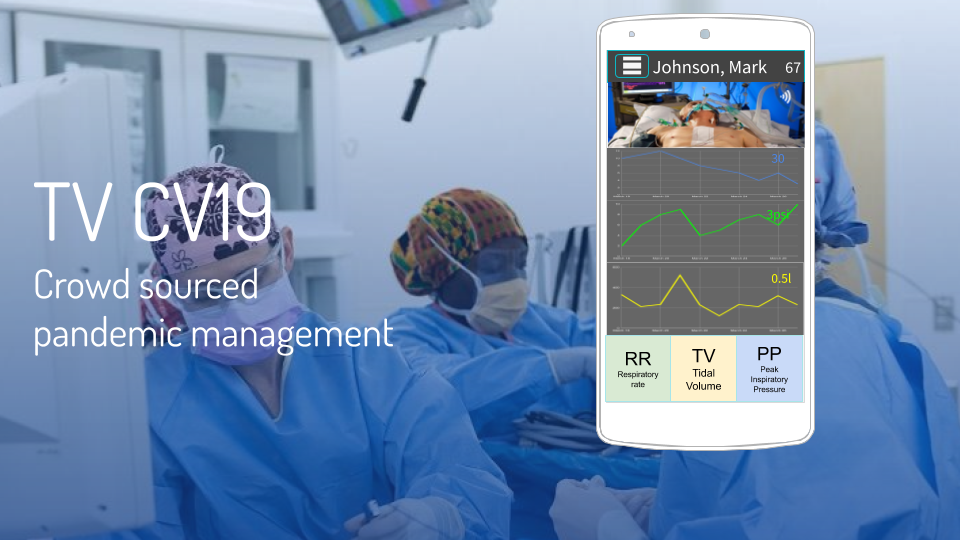

# TVCV19

 

**TV CV19** is an opensource telemedicine app to allow clinicians to better scale personnel resources.
Although hardware can be mass produced, clinician knowledge and experience cannot and this needs to be scaled out somehow.
Our platform aims to organize the heterogeneous hardware and manpower resources into a patient monitoring and decision making hierarchy.

If 10 COVID patients suddenly show up at a hospital with breathing difficulty, a misjudgement by the physician on who needs immediate intervention can be deadly. Our app allows caregivers to safely ration complex medical care to those who need it the most in order to save the most amount of lives.

This is how it works:

Traditionally, a bedside provider has to contact the physician via pager, a physician would then come to assess the patient at bedside, then put in orders before he/she can move onto the next patient.

The app provides instant access to a patient. A video feed along with real time patient data can be used by the supervising provider to assess a patient's condition. Once a decision is made, on the spot instructions can be given, or the supervisor can come prepared for a bedside procedure. This also means less exposure for doctors to infected patients, and less likely they’ll fall sick.

In cases where the supervising physician is overwhelmed or needs more complex help, the app allows quickly passing a patient to a specialist and ensures that cases are vetted before necessitating specialist attention.

You can learn more by browsing our [concept slides](https://docs.google.com/presentation/d/1jx_JJByAbFSXHXhZfbF9ar7q-Zx0MacvegpB00uDiNY/edit?usp=sharing) and listening to the accompanying [audio](https://www.uberconference.com/getmp3/AMIfv96b4tICKo7poclDD1wA3ljoQGVjX5lJ87UGyMusDsqpWrA9_SicAiTtTIgBCxpy7tUZsg8eZMD__9GbqGigc21ryxLr58KPmLOuIUcWgVltLQEmKRbjEPGKtYLqD_cy1Fx86Uls0aoCrx9p41Y52YWyEJF-Uw.mp3).

We are currently racing against the global novel coronavirus pandemic and could use a hand. 

If you want to contribute to the project, please fill out this [online form](https://docs.google.com/forms/d/e/1FAIpQLSf2osgKSobmYf0kSwzRrotV2hk5i8TjtZZdn5XptA1UjeIXVA/viewform)  and join our [slack channel](https://join.slack.com/t/scalablecv19solutions/shared_invite/zt-cxcbnbyu-yu4dxzaMjjnQvBGkQYVkxw) (#tv-cv19).
