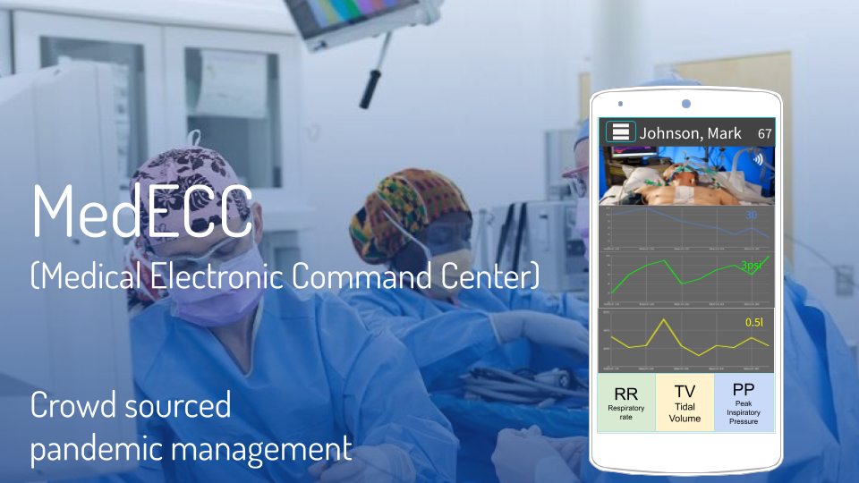

# TVCV19

 

**TV CV19** is an opensource telemedicine app to allow clinicians to better scale personnel resources.
Although hardware can be mass produced, clinician knowledge and experience cannot and this needs to be scaled out somehow.
Our platform aims to organize the heterogeneous hardware and manpower resources into a patient monitoring and decision making hierarchy.

You can learn more by browsing our [concept slides](https://docs.google.com/presentation/d/1jx_JJByAbFSXHXhZfbF9ar7q-Zx0MacvegpB00uDiNY/edit?usp=sharing) and listening to the accompanying [audio](https://www.uberconference.com/getmp3/AMIfv96b4tICKo7poclDD1wA3ljoQGVjX5lJ87UGyMusDsqpWrA9_SicAiTtTIgBCxpy7tUZsg8eZMD__9GbqGigc21ryxLr58KPmLOuIUcWgVltLQEmKRbjEPGKtYLqD_cy1Fx86Uls0aoCrx9p41Y52YWyEJF-Uw.mp3).

We are currently racing against the global novel coronavirus pandemic and could use a hand. 

If you want to contribute to the project, please fill out this [online form](https://docs.google.com/forms/d/e/1FAIpQLSf2osgKSobmYf0kSwzRrotV2hk5i8TjtZZdn5XptA1UjeIXVA/viewform)  and join our [slack channel](https://join.slack.com/t/scalablecv19solutions/shared_invite/zt-cxcbnbyu-yu4dxzaMjjnQvBGkQYVkxw) (#tv-cv19).