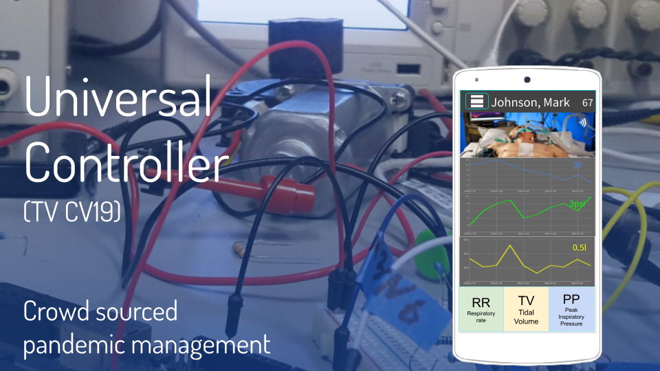

# Ventilator Control

 

**TV CV19** has remote control features for ventilators. Our goal is that skilled caregivers can more efficiently manage cases in times of crisis.
Ventilator control works using the audio jack of a smart phone to talk to the ventilator. This allows a patient's own phone to be used to remotely manage their case without any need for expensive computer equipment purchases.

A simple circuit needs to be built to control most ventilators, although we hope open source ventilators teams will consider building in support. The mobile app is [here](/mobileapp). If your ventilator does not have an audio jack, you can find example ventilator connectors [here](hardwareadapters/ventilatorconnectors). If you are an open source ventilator team that would like to add support for our interface, an example controller is [here](hardwareadapters/ventilatorcontrollers)