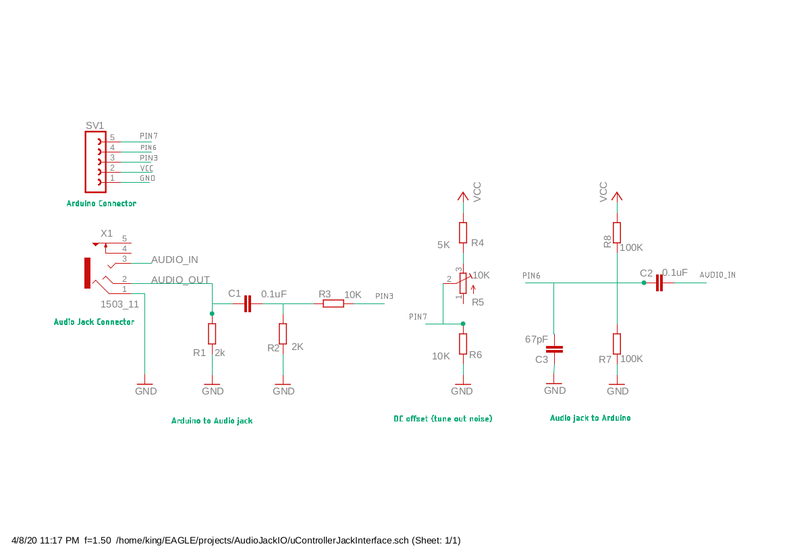
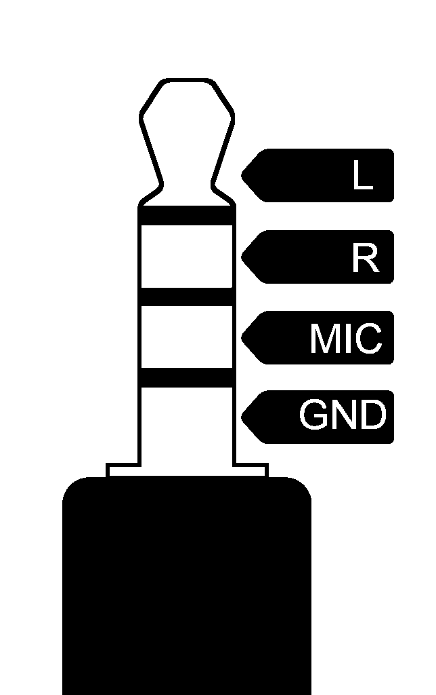

# Hardware Adapters

**TVCV19** has a mobile phone user interface. It is therefore important to be able to control a ventilator from an unmodified phone. Our hardware adapters have a 3.5mm jack that plugs into phones to alow this. We provide sample designs for a microcontroller interface [here](AudioJackIO) as EAGLE projects. 

Eagle is free for non-commercial use, so the designs can be modified to suit available components. Note that our circuits are designed for the  following 4pin 3.5mm jack style. Some jacks (apple jacks) swap gnd and mic. Be sure to check.

 